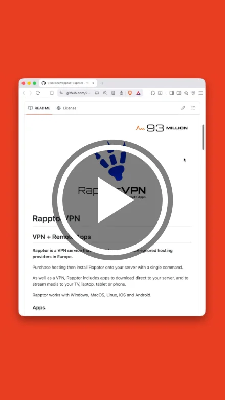
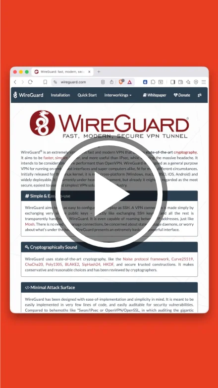

<div align="right">
  <picture>
    <source media="(prefers-color-scheme: dark)" srcset="docs/images/93million_logo-dark.svg" height="36" />
    
  </picture>
</div><br />
<div align="center">
  <picture>
    <source media="(prefers-color-scheme: dark)" srcset="docs/images/rapptor-logo-3-dark.svg" height="220" />
    
  </picture>
</div><br />

# RapptorVPN

## VPN + Remote Apps

**Fly under the radar by using low-cost, DMCA-ignored hosting as a VPN.**

Purchase hosting then install Rapptor onto your server with a single command.

As well as a VPN, Rapptor includes apps to download direct to your server, and to stream media to your TV, laptop, tablet or phone.

Rapptor works with Windows, MacOS, Linux, iOS and Android.

### Apps

Rapptor comes with the following apps that run on the server:

- **WireGuard Easy** - a WireGuard based VPN server
- **Transmission** - a BitTorrent server
- **Plex** - a video streaming server
- **Jellyfin** - an open source video streaming server
- **OwnCloud** - a Dropbox alternative
- **Nextcloud** - an open source Dropbox alternative

Apps are configured to work together without requiring additional configuration

Rapptor is tested against several VPS providers who offer DMCA ignored services in countries such as Switzerland, Netherlands and Moldova

### Benefits:


- **Purchase hosting - not a VPN:** VPNs are coming under increased scrutiny. Get a VPN without buying a VPN
- **Confidence there are no logs:** Being able to SSH into your server brings oversight that normal VPNs do not offer
- **Wipe your server clean:** Being able to delete everything from the command line or from your hosting provider control panel brings an extra level of security
- **Mobility between hosting providers:** If you find better hosting you can take Rapptor with you
- **Convenience domain:** Use your Rapptor domain (with SSL) to make things like connecting to Jellyfin easy and secure
- **Zero-conf apps:** Apps are designed to work together without the need for complex configuration

### Installation

1. Obtain suitable (DMCA ignored/offshore VPS) hosting with the following minimum specs:

    - Debian 11 or later
    - 1.5 GB ram
    - 10 GB storage (20GB+ recommended to install apps)

    If you require hosting see our list of [DMCA-ignored hosting providers](https://rapptorvpn.com/hosting).

2. Locate your server's **IP address** and **root password** (it may be in your hosting setup email - or in your hosting control panel)
3. Run this command to install Rapptor on your hosting:

  Windows Command Prompt:

  - Press the Windows key + R then enter the text `cmd` and press enter to open the command line
  - Enter the following command:

  ```sh
  cmd /V:ON /C "set /p IP=Enter server IP: & ssh -o ^"StrictHostKeyChecking off^" root@!IP! curl -s https://raw.githubusercontent.com/93million/rapptor/refs/heads/master/bin/install/install.sh ^| bash"
  ```

  Mac/Linux Terminal:

  - Open the ‘Terminal’ app
  - Enter the following command:

  ```sh
  echo -n "Enter server IP: " && read IP && ssh -o "StrictHostKeyChecking off" root@$IP "curl -s https://raw.githubusercontent.com/93million/rapptor/refs/heads/master/bin/install/install.sh | bash"
  ```

4. After the installation script has completed a URL is displayed in the Terminal. Open the URL in a browser to choose a Rapptor domain and finish setting up Rapptor (it may take 60 seconds before it is working)

VPN functionality is included through the app 'WireGuard Easy VPN' which is installed by default. Use the App Store to install other apps that you may wish to use

#### Video: How to install RapptorVPN

<div align="center"><a href="https://www.youtube.com/watch?v=BZvlDda4Mdw&list=PLAztgkA2yF6Sga17qvFcv8jOmGnicWnM3&index=1" target="_blank">
  
</a></div>

#### Can I install without giving my server IP and root login details?

Yes - as long as you are comfortable using the command line. SSH into your server and run this command:

```sh
curl -s https://raw.githubusercontent.com/93million/rapptor/refs/heads/master/bin/install/install.sh | bash
```

### Setting up WireGuard VPN

VPN functionality is implemented through WireGuard. You can set up clients in Rapptor through the `WireGuard Easy VPN` app. Clients for many platforms can be found at [wireguard.com/install](https://www.wireguard.com/install/).

To add a new VPN client, open the ‘WireGuard Easy VPN’ app on Rapptor and find the section labelled Clients. Click on the button labeled `+ New` and enter a name, then click `Create`.

Download the client config or scan the QR code to import the VPN connection to your desktop or mobile device.

See [docs/WireGuard.md](docs/WireGuard.md) for more info

#### Video: Connecting to WireGuard VPN through RapptorVPN

<div align="center"><a href="https://www.youtube.com/watch?v=yQSfd0Alt9o&list=PLAztgkA2yF6Sga17qvFcv8jOmGnicWnM3&index=2" target="_blank">
  
</a></div>

### Reset password

If you forgot your Rapptor password you can set Rapptor up again by running the following command and following the setup link:

Windows Command Prompt:

```sh
cmd /V:ON /C "set /p IP=Enter server IP: & ssh root@!IP! rapptor setuplink"
```

Mac/Linux Terminal:

```sh
echo -n "Enter server IP: " && read IP && ssh root@$IP "rapptor setuplink"
```

### Find Rapptor URL

If you forgot the domain you chose to access Rapptor you can find it by running the following command:

Windows Command Prompt:

```sh
cmd /V:ON /C "set /p IP=Enter server IP: & ssh root@!IP! rapptor geturl"
```

Mac/Linux Terminal:

```sh
echo -n "Enter server IP: " && read IP && ssh root@$IP "rapptor geturl"
```

### Restart Rapptor

You can restart Rapptor by running the following command:

Windows Command Prompt:

```sh
cmd /V:ON /C "set /p IP=Enter server IP: & ssh root@!IP! rapptor restart"
```

Mac/Linux Terminal:

```sh
echo -n "Enter server IP: " && read IP && ssh root@$IP "rapptor restart"
```

### Reboot server

You can restart your server by running the following command:

Windows Command Prompt:

```sh
cmd /V:ON /C "set /p IP=Enter server IP: & ssh root@!IP! reboot"
```

Mac/Linux Terminal:

```sh
echo -n "Enter server IP: " && read IP && ssh root@$IP reboot
```

### Wiping your server

You can wipe your server by running the following command:

Windows Command Prompt:

```sh
cmd /V:ON /C "set /p IP=Enter server IP: & ssh root@!IP! /var/docker/rapptor/bin/wipe"
```

Mac/Linux Terminal:

```sh
echo -n "Enter server IP: " && read IP && ssh root@$IP "/var/docker/rapptor/bin/wipe"
```

For more information about wiping, see [docs/Wiping Your Server.md](docs/Wiping%20Your%20Server.md)

### Streaming with Jellyfin

When connecting to Jellyfin server from a smart TV, tablet, enter the address as follows: `https://<rapptordomain>:8920`. For example if your Rapptor domain is jonny.rapptor.wtf then enter `https://jonny.rapptor.wtf:8920`

Enter the username and password you created when you first launched Jellyfin

For information about using Jellyfin on your TV see [docs/Jellyfin.md](docs/Jellyfin.md)

#### Video: Using Transmission and Jellyfin with RapptorVPN

<div align="center"><a href="https://www.youtube.com/watch?v=goV53jb0S4A&list=PLAztgkA2yF6Sga17qvFcv8jOmGnicWnM3&index=3" target="_blank">
  
</a></div>

### Running NextCloud and OwnCloud for the first time

Before you can log in you will need to set an admin password.

- Open NextCloud/OwnCloud
- Click the settings icon (shaped like a cog ⚙️) at the top for the screen next to the close icon
- Enter an admin password and click submit
- Log in with the username `admin` and the password you just entered

*Copyright 93 Million. All rights reserved*

<br />
<p align="center">
  <picture>
    <source media="(prefers-color-scheme: dark)" srcset="docs/images/93million_logo-dark.svg" height="48" />
    
  </picture>
</p>
